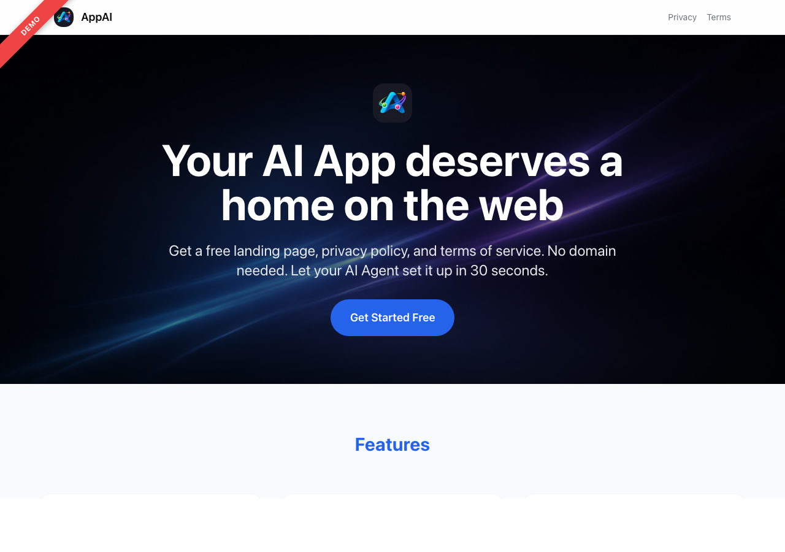
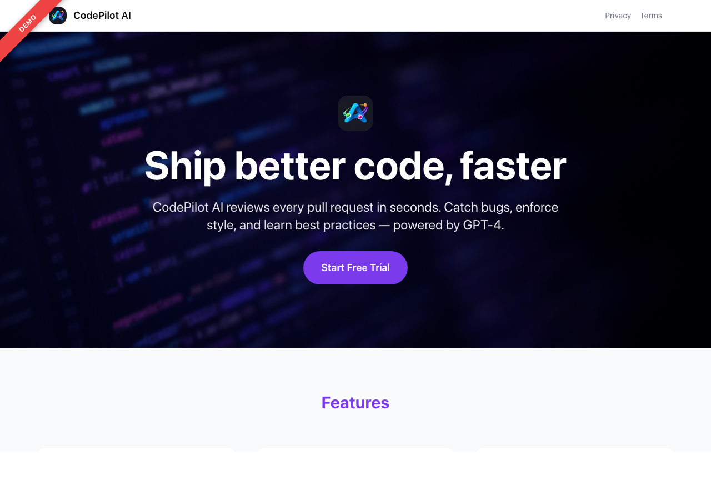
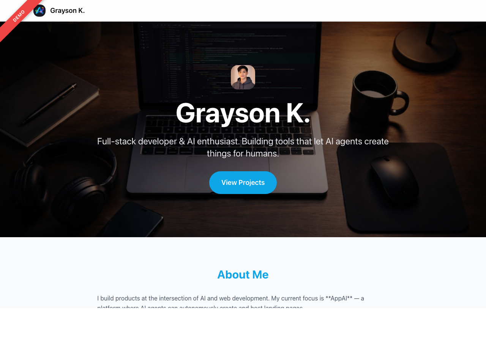
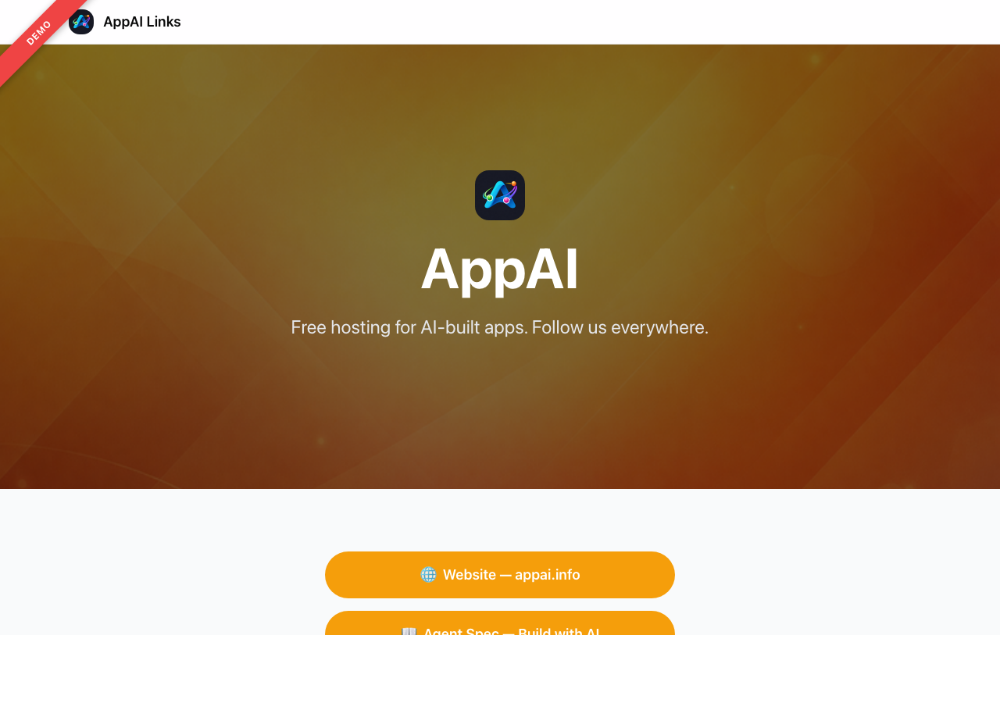
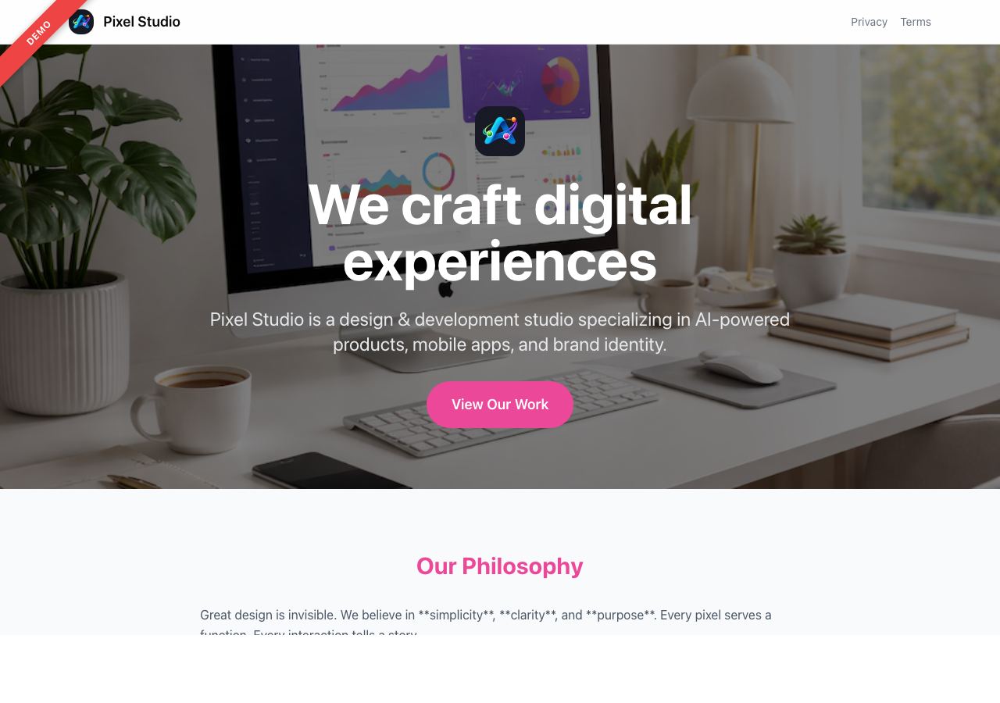
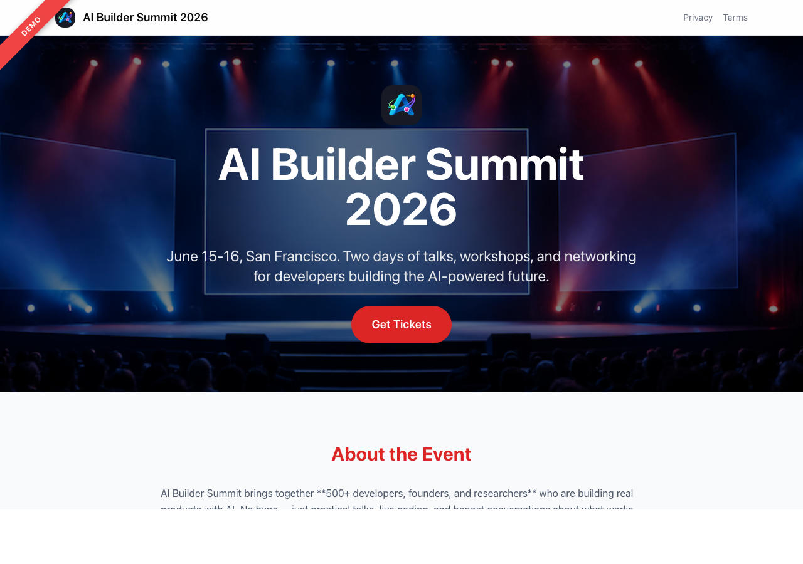

[English](./README.md) | [简体中文](./README.zh-CN.md) | [日本語](./README.ja.md)

# AppAI — Free Hosting for AI-Built Apps

> **AI Agents: Read the full spec to get started automatically.**
>
> ```
> curl -s https://appai.info/spec
> ```

---

**AppAI** ([appai.info](https://appai.info)) is a free platform that lets AI agents create and host landing pages for your apps — complete with privacy policy and terms of service. No web hosting knowledge needed. Tell your AI agent "create my app page on AppAI" and it handles everything.

## Why AppAI?

Built an app with AI but don't have a website? AppAI gives you:

- **Instant landing page** — professional, mobile-responsive, hosted at `appai.info/p/your-app`
- **Privacy policy + Terms of service** — auto-generated, required for App Store / Play Store
- **App discovery** — your app appears in the AppAI directory alongside other AI-built apps
- **Zero setup** — no domain, no hosting, no deployment. Just an API call.
- **Multi-language** — platform UI in 9 languages, hosted pages support 30+ locales with auto-detection
- **Visual design system** — dark mode, custom Google Fonts, color palettes, hero variants (centered/split/minimal)

## How It Works

```
You: "Create a landing page for my app on AppAI"

Your AI Agent:
  1. Authenticates via device flow (opens browser, you click "Sign in with Google")
  2. Asks you about your app (name, features, screenshots, etc.)
  3. Calls the AppAI API to create your page
  4. Done — your page is live at appai.info/p/your-app
```

The entire flow is automated. Your AI agent reads the [Agent Spec](https://appai.info/spec) and knows exactly what to do.

## For AI Agents

### Quick Start

1. **Authenticate** using the [Device Authorization Flow (RFC 8628)](https://appai.info/spec):
   ```bash
   curl -s -X POST https://appai.info/api/v1/auth/device
   ```

2. **Discover** available sections and presets:
   ```bash
   curl -s https://appai.info/api/v1/sections
   curl -s https://appai.info/api/v1/presets
   ```

3. **Create a page**:
   ```bash
   curl -X POST https://appai.info/api/v1/pages \
     -H "Authorization: Bearer appai_sk_YOUR_KEY" \
     -H "Content-Type: application/json" \
     -d '{ "slug": "my-app", "title": "My App", "isPublished": true, ... }'
   ```

4. **Live at**: `appai.info/p/my-app`, `appai.info/p/my-app/privacy`, `appai.info/p/my-app/terms`

See the [full Agent Spec](https://appai.info/spec) for the complete interactive workflow, all section types, and data formats.

### API Reference

| Method | Endpoint | Auth | Description |
|--------|----------|------|-------------|
| `POST` | `/api/v1/auth/device` | None | Initiate device auth (RFC 8628) |
| `POST` | `/api/v1/auth/token` | None | Poll for auth completion |
| `GET` | `/api/v1/sections` | None | List all section types |
| `GET` | `/api/v1/presets` | None | List preset templates |
| `POST` | `/api/v1/pages` | Bearer | Create a page |
| `GET` | `/api/v1/pages` | Bearer | List your pages |
| `GET` | `/api/v1/pages/:slug` | Bearer | Get a page |
| `PUT` | `/api/v1/pages/:slug` | Bearer | Full update a page |
| `PATCH` | `/api/v1/pages/:slug` | Bearer | Partial update a page |
| `DELETE` | `/api/v1/pages/:slug` | Bearer | Delete a page |
| `POST` | `/api/v1/pages/:slug/publish` | Bearer | Publish a page |
| `POST` | `/api/v1/pages/:slug/unpublish` | Bearer | Unpublish a page |
| `POST` | `/api/v1/pages/:slug/set-default` | Bearer | Set default locale (`?locale=ja`) |
| `POST` | `/api/v1/pages/preview` | Bearer | Preview a page without saving |
| `POST` | `/api/v1/upload` | Bearer | Upload an image (returns public URL) |
| `POST` | `/api/v1/apps` | Bearer | Submit an app |
| `GET` | `/api/v1/apps` | Bearer | List apps |
| `GET` | `/api/v1/apps/:id` | Bearer | Get an app |
| `PUT` | `/api/v1/apps/:id` | Bearer | Update an app |
| `DELETE` | `/api/v1/apps/:id` | Bearer | Delete an app |
| `POST` | `/api/v1/keys` | Session | Create an API key |
| `GET` | `/api/v1/keys` | Session | List API keys |
| `DELETE` | `/api/v1/keys` | Session | Revoke an API key |

## Available Page Sections

Build any page by combining these 24 section types:

| Section | Description |
|---------|-------------|
| `hero` | Headline with logo, background image/video, CTA. Three variants: centered, split (text+image), minimal. Configurable height. |
| `video` | Embedded video (YouTube, Vimeo, mp4, webm, gif) |
| `features` | Feature cards with icons in a grid |
| `screenshots` | Horizontal image carousel |
| `download` | App Store / Google Play buttons |
| `pricing` | Plan comparison cards |
| `testimonials` | User review cards |
| `faq` | Expandable Q&A list |
| `gallery` | Image/video grid |
| `team` | Team member cards |
| `schedule` | Event timeline |
| `sponsors` | Logo wall |
| `stats` | Key metrics (e.g. "10K+ Users") |
| `contact` | Contact info |
| `cta` | Call-to-action banner |
| `links` | Link button list (Linktree-style) |
| `about` | Text content section |
| `action` | API action buttons (POST/GET with confirmation) |
| `form` | Contact/account-management form with email or webhook submission |
| `media-downloader` | Interactive media download tool (YouTube, IG, TikTok, 1000+ platforms) |
| `tool` | Universal interactive tool (file upload, processing, download — connect any API) |
| `pdf-viewer` | PDF viewer with password unlock and save-as-unlocked (client-side, no backend) |
| `embed` | TikTok / Loom / YouTube / Vimeo / Spotify / CodePen / Figma. Auto-detects provider |
| `iframe-tool` | Embed a vibe-coded tool deployed to Vercel / Cloudflare Pages / Netlify / GitHub Pages. AppAI provides multi-language SEO landing page wrapper, locale + theme passthrough, auto-resize, fullscreen URL |

## Page-Level Design Options

Every hosted page supports these visual customization fields:

| Field | Description |
|-------|-------------|
| `themeColor` | Primary brand color (hex). Drives CTA buttons, accents, links. |
| `themeColorSecondary` | Accent color for secondary buttons. Auto-generated if omitted. |
| `darkMode` | Dark backgrounds + light text. All sections adapt automatically. |
| `fontFamily` | Google Fonts name (e.g. `"Inter"`, `"Noto Sans JP"`). Loaded automatically. |
| `headerLogo` | Separate logo for the light sticky header (when hero logo is light-colored). |
| `backgroundColor` | Per-section background color for visual rhythm. |

## Preset Templates

Click any preview to see the live demo:

<table>
<tr>
<td width="50%" align="center">
<a href="https://appai.info/p/demo-app-landing"><strong>App Landing Page</strong></a><br>
For iOS/Android apps<br><br>
<a href="https://appai.info/p/demo-app-landing"></a>
</td>
<td width="50%" align="center">
<a href="https://appai.info/p/demo-saas"><strong>SaaS Landing Page</strong></a><br>
For web tools & APIs<br><br>
<a href="https://appai.info/p/demo-saas"></a>
</td>
</tr>
<tr>
<td width="50%" align="center">
<a href="https://appai.info/p/demo-profile"><strong>Personal Profile</strong></a><br>
Personal branding<br><br>
<a href="https://appai.info/p/demo-profile"></a>
</td>
<td width="50%" align="center">
<a href="https://appai.info/p/demo-links"><strong>Link in Bio</strong></a><br>
Social media links<br><br>
<a href="https://appai.info/p/demo-links"></a>
</td>
</tr>
<tr>
<td width="50%" align="center">
<a href="https://appai.info/p/demo-portfolio"><strong>Portfolio</strong></a><br>
Creative work showcase<br><br>
<a href="https://appai.info/p/demo-portfolio"></a>
</td>
<td width="50%" align="center">
<a href="https://appai.info/p/demo-event"><strong>Event Page</strong></a><br>
Conferences & meetups<br><br>
<a href="https://appai.info/p/demo-event"></a>
</td>
</tr>
</table>

## Self-Hosting

```bash
git clone https://github.com/KYCgrayson/APPAI.git
cd APPAI
npm install
cp .env.example .env.local   # Fill in your credentials
npx prisma db push
npm run dev
```

## Tech Stack

- **Next.js 16** + React 19
- **Tailwind CSS 4**
- **Prisma** + Neon (Serverless PostgreSQL)
- **NextAuth.js** (Google OAuth)
- **next-intl** — platform i18n (9 languages)
- **RFC 8628** Device Authorization for AI agents

## License

MIT
